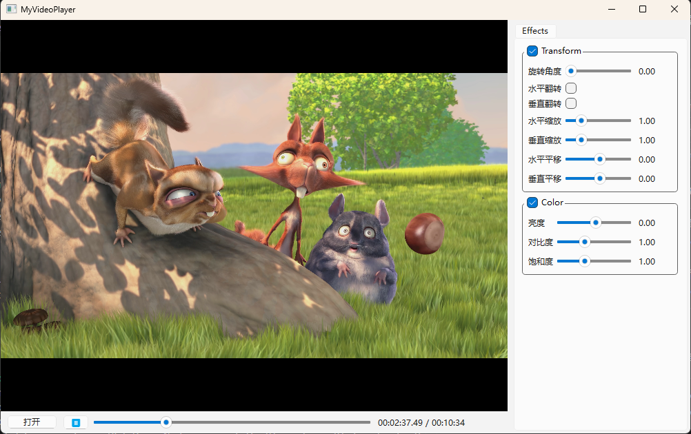

# MyVideoPlayer

一个基于 FFmpeg + SDL3 + Qt6 构建的媒体工具集，核心为轻量级视频播放器，参考 FFplay / MPV / VLC 等主流播放器架构设计。包含播放器、视频特效、转码器等功能，均构建在统一的 MediaGraph 节点图引擎之上。

## 运行截图



## 功能特性

### 播放器
- 支持 FFmpeg 所支持的所有视频/音频格式
- 音视频同步（Audio Master 时钟驱动）
- 播放 / 暂停 / Seek / 逐帧步进
- SDL3 硬件加速视频渲染（嵌入 Qt 窗口）
- 状态机驱动的播放生命周期管理
- EOF 优雅传播与自动停止
- 基于 MediaGraph 节点图的管线架构

### 视频特效
- 色彩调节（亮度/对比度/饱和度/色相）
- 变换特效（缩放/旋转/裁剪）

### 转码器
- 命令行转码工具（`mvp_transcode_cli`）
- 支持软件编码（H.264 / AAC）
- 基于 MediaGraph 的 Demux→Decode→Encode→Mux 管线

### UI
- 现代化扁平风格界面（QStyleSheet）
- 导航栏 + Dashboard 主页 + 播放器页 + 转码器页
- 特效面板（实时调节 + 重置）
- 播放列表（拖拽排序）

## 架构概览

```
┌──────────────────────────────────────────────────────────┐
│                    Qt6 GUI (mvp_app)                      │
│    MainWindow / VideoWidget / EffectPanel / TranscoderPage│
├──────────────────────────────────────────────────────────┤
│              Application Facade (mvp_media)               │
│  ┌──────────────┐  ┌────────────────┐  ┌──────────────┐  │
│  │ MediaPlayer  │  │  Transcoder    │  │  (future)     │  │
│  │ (facade)     │  │  (facade)      │  │  Recorder...  │  │
│  └──────┬───────┘  └───────┬────────┘  └──────────────┘  │
│         │                  │                              │
│         └──────────┬───────┘                              │
│                    ▼                                      │
│  ┌─────────────────────────────────────────────────────┐  │
│  │              MediaGraph Engine                       │  │
│  │                                                      │  │
│  │  ┌──────────┐  ┌──────────┐  ┌──────────────────┐  │  │
│  │  │DemuxNode │→ │DecodeNode│→ │ColorEffectNode   │  │  │
│  │  │(source)  │  │          │  │TransformEffectNode│  │  │
│  │  └──────────┘  └──────────┘  └───────┬──────────┘  │  │
│  │                                      │              │  │
│  │  ┌──────────────┐  ┌────────────────┴───────────┐  │  │
│  │  │ AudioSinkNode│  │ VideoSinkNode              │  │  │
│  │  │ (SDL3 audio) │  │ (SDL3 texture → Qt widget) │  │  │
│  │  └──────────────┘  └────────────────────────────┘  │  │
│  │                                                      │  │
│  │  Nodes connected via Port ⇄ Link (bounded async Q)   │  │
│  │  Unified data carrier: MediaBuffer(Packet/Frame)     │  │
│  │  Clock / Sync / EffectManager                        │  │
│  └─────────────────────────────────────────────────────┘  │
└──────────────────────────────────────────────────────────┘
```

### 核心设计原则

- **Toolbox 工具箱架构**：MediaPlayer、Transcoder 等均为独立 facade 层类，共享底层 MediaGraph 引擎
- **节点图管线**：功能拆分为可组合的节点（DemuxNode、DecoderNode、EffectNode、SinkNode 等），通过 Port + Link（有界异步队列）连接
- **统一数据载体**：节点间传输使用 `MediaBuffer`（`std::variant<AVPacketPtr, MediaFrame>`），不再混用 AVPacket/AVFrame
- **背压机制**：Link 的有界容量提供天然背压，生产者阻塞直到消费者处理完毕

## 依赖

| 库 | 版本要求 | 用途 |
|---|---|---|
| FFmpeg | >= 7.1 | 解封装、解码、编码、mux |
| SDL3 | >= 3.2 | 音频播放、视频渲染 |
| Qt6 | >= 6.7 | GUI 框架 |
| spdlog | >= 1.12 | 日志 |
| CMake | >= 3.20 | 构建系统 |
| MSVC | 2022+ | 编译器（当前仅支持 Windows，需 x64 架构） |

## 构建方法

### 前置条件

1. 安装 [Visual Studio 2022](https://visualstudio.microsoft.com/)（含「使用 C++ 的桌面开发」工作负载）
2. 安装 [CMake](https://cmake.org/download/) >= 3.20
3. 下载以下依赖的预编译版本：
   - [FFmpeg Shared Build](https://github.com/BtbN/FFmpeg-Builds/releases)（选 `shared` 版本，解压即可）
   - [SDL3](https://github.com/libsdl-org/SDL/releases)（下载 `SDL3-devel-x.x.x-VC.zip`）
   - [Qt 6](https://www.qt.io/download)（安装时选择 MSVC 2022 64-bit 组件）
   - [spdlog](https://github.com/gabime/spdlog/releases)（需自行 CMake 编译安装，见下方说明）

#### spdlog 编译安装示例

```bash
git clone https://github.com/gabime/spdlog.git
cd spdlog && mkdir build && cd build
cmake .. -DCMAKE_INSTALL_PREFIX="C:/libs/spdlog" -DSPDLOG_BUILD_SHARED=OFF
cmake --build . --config Release
cmake --install .
```

### 方式一：VS Code + Ninja 构建

项目已内置 `CMakePresets.json`，包含 `default`（Ninja）和 `vs2026`（VS）两个 preset。

如需覆盖依赖路径（例如你的安装目录与预设不同），在根目录创建 `CMakeUserPresets.json`（已在 `.gitignore` 中忽略）：

```json
{
  "version": 6,
  "configurePresets": [
    {
      "name": "local",
      "inherits": "default",
      "cacheVariables": {
        "CMAKE_PREFIX_PATH": "<你的Qt安装路径>/6.7.3/msvc2022_64",
        "FFMPEG_ROOT": "<你的FFmpeg解压路径>",
        "SDL3_DIR": "<你的SDL3解压路径>/cmake",
        "spdlog_DIR": "<你的spdlog安装路径>/lib/cmake/spdlog"
      }
    }
  ],
  "buildPresets": [
    {
      "name": "local",
      "configurePreset": "local"
    }
  ]
}
```

然后执行：

```bash
cmake --preset local
cmake --build build
```

> **注意**：需要在 **x64 Native Tools Command Prompt for VS 2022**（或 VS Code 中已配置 MSVC 环境的终端）下执行，以确保 `cl.exe` 在 PATH 中。

### 方式二：Visual Studio IDE 构建

项目已内置 `CMakePresets.json` 中的 `vs2026` preset。如需自定义依赖路径，创建 `CMakeUserPresets.json`：

```json
{
  "version": 6,
  "configurePresets": [
    {
      "name": "vs-local",
      "inherits": "vs2026",
      "cacheVariables": {
        "CMAKE_PREFIX_PATH": "<你的Qt安装路径>/6.7.3/msvc2022_64",
        "FFMPEG_ROOT": "<你的FFmpeg解压路径>",
        "SDL3_DIR": "<你的SDL3解压路径>/cmake",
        "spdlog_DIR": "<你的spdlog安装路径>/lib/cmake/spdlog"
      }
    }
  ]
}
```

```bash
cmake --preset vs-local
```

然后用 Visual Studio 打开 `build-vs/MyVideoPlayer.slnx`，选择 Debug/x64 配置编译即可。

### 路径填写说明

| 变量 | 指向什么 | 示例值 |
|------|---------|--------|
| `CMAKE_PREFIX_PATH` | Qt MSVC 编译版本的根目录（包含 `lib/cmake/Qt6`） | `D:/Qt/6.7.3/msvc2022_64` |
| `FFMPEG_ROOT` | FFmpeg shared build 解压后的根目录（包含 `bin/`, `lib/`, `include/`） | `D:/libs/ffmpeg-7.1.1-full_build-shared` |
| `SDL3_DIR` | SDL3 安装目录下的 `cmake` 子目录（包含 `SDL3Config.cmake`） | `D:/libs/SDL3-3.2.16/cmake` |
| `spdlog_DIR` | spdlog 安装目录下的 CMake 配置目录（包含 `spdlogConfig.cmake`） | `D:/libs/spdlog/lib/cmake/spdlog` |

> 路径使用正斜杠 `/` 或双反斜杠 `\\`，**不要**使用单反斜杠 `\`。

> **提示**：如果直接使用内置 preset（不创建 `CMakeUserPresets.json`），依赖路径已预设为本机开发路径。
> 如果你的安装目录不同，使用 `"inherits": "default"` 或 `"inherits": "vs2026"` 继承内置预设后再覆盖即可。

### 运行

编译成功后，产物位于 `build/bin/`（Ninja）或 `build-vs/bin/Debug/`（VS）：

| 产物 | 说明 |
|------|------|
| `mvp_app.exe` | Qt GUI 播放器应用 |
| `mvp_media.dll` / `mvp_media.lib` | 媒体引擎动态库（播放器核心 + MediaGraph） |
| `mvp_transcode_cli.exe` | 命令行转码工具（不依赖 Qt） |

所需 DLL 会在构建时自动复制到同目录。

## 项目结构

```
src/
├── media/          # 媒体引擎库 (mvp_media)
│   ├── graph/      #   MediaGraph 核心：Node, Port, Link, MediaBuffer, MediaFormat
│   ├── nodes/      #   具体节点实现：DemuxNode, DecoderNode, AudioSinkNode,
│   │               #     VideoSinkNode, ColorEffectNode, TransformEffectNode,
│   │               #     EncoderNode, MuxNode
│   ├── clock.h     #   音视频同步时钟
│   ├── media_frame.h / .cc    #   媒体帧抽象（不暴露 FFmpeg 类型）
│   ├── media_player.h / .cc   #   MediaPlayer facade
│   ├── transcoder.cc          #   Transcoder facade
│   ├── effect_manager.cc      #   特效管理器
│   ├── video_renderer.cc      #   SDL3 视频渲染
│   └── pixel_ops.cc           #   像素格式转换
├── app/            # Qt GUI 应用 (mvp_app)
│   ├── main.cc, main_window.cc/h
│   ├── video_widget.cc/h
│   ├── player_page.cc/h       #   播放器页面
│   ├── home_page.cc/h         #   Dashboard 主页
│   ├── dashboard_card.cc/h    #   仪表盘卡片组件
│   ├── transcoder_page.cc/h   #   转码器页面
│   ├── effect_panel.cc/h      #   特效面板
│   ├── navigation_bar.cc/h    #   导航栏
│   ├── title_bar.cc/h         #   标题栏
│   └── ...                    #   其他 UI 组件
└── tools/          # 命令行工具
    └── transcode_cli/         # 转码 CLI (mvp_transcode_cli)

include/mvp/        # 公开头文件（库使用者可见）
├── media_player.h
├── transcoder.h
├── transcode_options.h
├── source_info.h / source_probe.h
├── effect_types.h
├── logging.h
└── export.h

cmake/              # 自定义 CMake 模块 (FindFFmpeg.cmake)
docs/               # 设计文档
openspec/           # AI 辅助的 Spec-Driven 开发工作流
```

## 开发工作流（OpenSpec）

本项目使用 [OpenSpec](https://github.com/Fission-AI/OpenSpec) 工作流进行 AI 辅助的架构设计与任务管理。`openspec/` 目录结构：

```
openspec/
├── config.yaml               # 工作流配置
├── specs/                    # 模块规格文档（长期维护）
│   ├── media-graph-core/     #   MediaGraph 核心：节点、端口、链接、数据载体
│   ├── graph-source-nodes/   #   源节点（DemuxNode）
│   ├── graph-transform-nodes/#   变换节点（特效、AVFilter）
│   ├── graph-sink-nodes/     #   汇节点（AudioSinkNode、VideoSinkNode）
│   ├── graph-effect-nodes/   #   特效节点
│   ├── graph-playback/       #   播放图构建
│   ├── graph-transcode/      #   转码图构建（EncoderNode、MuxNode）
│   ├── graph-command-control/ #   节点命令与控制
│   ├── graph-node-lifecycle/ #   节点生命周期
│   ├── graph-shared-resources/#   跨节点共享资源
│   ├── demux-decode/         #   解封装与解码模块
│   ├── av-sync/              #   音视频同步
│   ├── video-renderer/       #   视频渲染
│   ├── frame-abstraction/    #   媒体帧抽象
│   ├── frame-position/       #   帧定位
│   ├── frame-timer-sync/     #   帧定时同步
│   ├── player-state-machine/ #   播放器状态机
│   ├── playback-control/     #   播放控制
│   ├── playback-graph-builder/#   播放图构建器
│   ├── port-format-negotiation/ # 端口格式协商
│   ├── seek-consistency/     #   Seek 一致性
│   ├── eof-propagation/      #   EOF 传播
│   ├── wall-clock/           #   墙钟
│   ├── link-capacity/        #   链接容量策略
│   ├── hw-accel/             #   硬件加速
│   ├── pixel-ops/            #   像素格式转换
│   ├── source-info/          #   源信息
│   ├── source-probe/         #   源探测
│   ├── stream-context/       #   流上下文
│   ├── app-shell-ui/         #   UI 外壳
│   ├── home-dashboard-ui/    #   Dashboard 主页 UI
│   ├── player-ui/            #   播放器 UI
│   ├── effect-panel-ui/      #   特效面板 UI
│   ├── transcoder-ui/        #   转码器 UI
│   ├── decoder-interface/    #   解码器接口
│   ├── logging/              #   日志
│   └── code-comment-sync/    #   注释同步
└── changes/                  # 变更记录
    └── archive/              #   已完成的变更（含设计文档与任务清单）
```

**工作方式：**

1. **Spec（规格）** — 每个核心模块有一份 `spec.md`，描述模块职责、接口契约、同步策略等设计约束
2. **Change（变更）** — 每次功能开发/重构先生成 proposal + tasks，实现完毕后归档到 `changes/archive/`
3. **AI 协作** — 通过 Copilot Agent 读取 spec 上下文，确保代码实现符合架构设计

这套流程让每次改动都有据可查，也方便后续回顾设计决策的演进过程。
